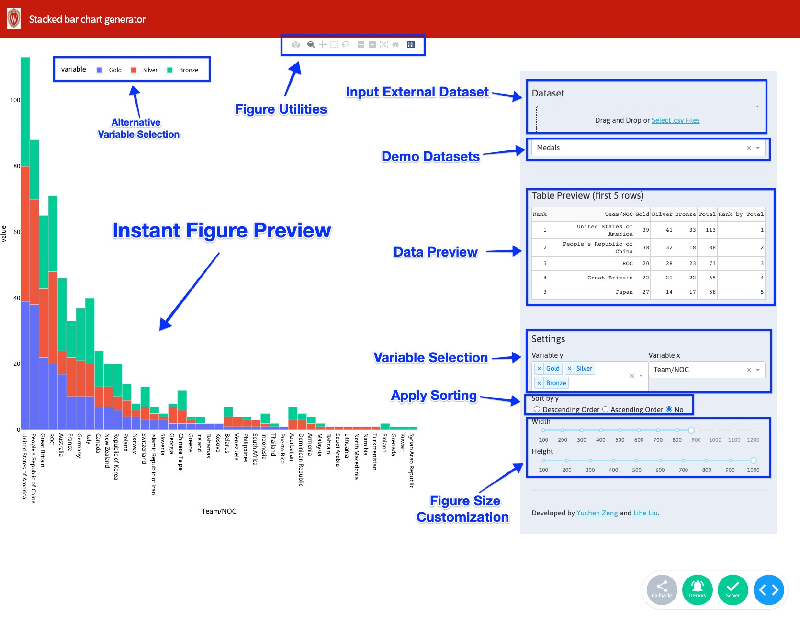

# Stacked-bar-chart-visualizer
## UW-Madison 2021 Fall CS765 Data Visualization
## Course Final Project - Design Challenge 2
### [Yuchen Zeng](https://github.com/yzeng58), [Lihe Liu](https://github.com/liulihe954)

### 1. Motivation and Goal
Stacked bar graphs (SBG) can be used to visualize the quantitative relationship that exists between a main category and its subcategories. Each bar represents a primary category and will be divided into different section that represents the subcategories for a second categorical variable. 

However, there are many challenges in automatically resizing SBG. The change of the size and/or the aspect ratio of plotting frame will make the content too compact/skewed, and/or obscure the underlying relationship. Such limitation will create perceptional challenge and affect the visualization effectiveness. 

The goal of this project is to develop a web app that visualizes the input dataset as a stacked bar chart in the required figure size.

Our main expectations are:

- developing an efficient algorithm which automatically adapts a stacked bar chart to a smaller size;

- building a small program which takes an external dataset, required figure size, two categorical variables and one numerical positive variable as input, and output a stacked bar chart with the expected figure size;

- embedding the resizing algorithm into the program and building a user-friendly web app that can automatically generate customized stacked bar charts.

### 2. About this Tool

#### 2.1 Description

Our application has a user-friendly interface with two panels.(As shown)

The right panel has:

- Data input and selection: We provide data input feature where user could provide their dataset as a .csv file. Note the provided dataset should be well-organized since data cleaning is beyond the scope of this tool. For a well-formatted dataset, user would be able to select whatever available variables to encode (see variable selection feature below). We also have two simple datasets provided for demonstration purpose. They are [2021 Tokyo Olympics medals counts by country](https://www.kaggle.com/arjunprasadsarkhel/2021-olympics-in-tokyo?select=Medals.xlsx) and [US Export of Plastic Scrap](https://plotly.com/python/bar-charts/). 

- Data Preview: The first 5 rows will be briefly shown in this section.

- Variable Selection: All available variables will be collected and shown in dropdown boxes for selection. A variable can be encoded to either the X or Y axis.

- Sorting: Sorting can be applied to the variable(s) encoded to the Y-axis using the radio buttons provided.

- Size Customization: Figure width and height can be specified using the slider provided. Values outside the provided range may be able to be applied temporarily.

The left panel has:

- Figure Utilities: On the top, a set of functions, including downloading the current figure, can be accessed directly by clicking.

- Instant Figure Preview: A preview of the dataset with the current parameters.

- Alternative Variable Selection: The figure legend is displayed and can be used as an alterant for variable selection by simply clicking on the corresponding variable.

#### 2.2 Implementation
[Stacked bar chart visualizer](https://tiny-visualizer.herokuapp.com/) is currently 
available online.

Alternatively: 

user could download this repository and run `python app.py`.

Then access http://127.0.0.1:1234/ using your web browser.

### 3. Application Framework
This tool is developed using [Dash apps](https://plotly.com/dash/).  

This tool is deployed with [Heroku](https://www.heroku.com/).

